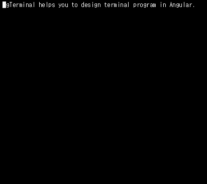

# NgTerminal

NgTerminal is a interactive terminal component on Angular. `NgTerminal` component is simply controlled by `Disposable` object.

This project contains a example and a core library.



## Install

```
npm install ng-terminal
```

## Example

You can run a sample project in your local environment.

1) git clone https://github.com/qwefgh90/ng-terminal.git
2) npm install
3) ng serve

#### Descriptions

Modules should be imported in `app.module.ts`.

```typescript
import { NgTerminalModule } from 'ng-terminal';
//your codes
@NgModule({
    imports: [
        NgTerminalModule
    //your codes
```

Implements your callback functions to your `app.component.ts`.

```typescript
import { Disposible } from 'ng-terminal';
    //your codes
    onInit(disposable: Disposable) {
      disposable.println('https://github.com/qwefgh90/ng-terminal')
        .println('Welcome to NgTerminal!!').prompt('ng>');
    }

    onNext(disposable: Disposable) {
      if (disposable.event.key == 'Enter') {
        let newDisposable = disposable.println('').println('something is in progress...')
        setTimeout(() => { newDisposable.println('').print('').print('complete!').prompt('ng>'); }, 2000);
      } else
        disposable.handle();
}
```

And, add `<ng-terminal>` to your `app.component.html` with your callback functions.

```html
  <ng-terminal 
    (onInit)="onInit($event)" 
    (onNext)="onNext($event)">
  </ng-terminal>
```

## API

Here is `<ng-terminal>` tag that you can use in your templates.

```html
    <ng-terminal
      (onInit)="onInit($event)" 
      (onNext)="onNext($event)">
    </ng-terminal>
```


#### NgTerminal

`<ng-terminal>` is a angular component which is put into your applications.

```typescript
class ngTerminalComponent {
  @Output() onNext = new EventEmitter<Disposable>();
  @Output() onInit = new EventEmitter<Disposable>();
}
```

*You must register two callback functions.* After `NgTerminal` component is initialized, `onInit()` is called only **once** like ngInit(). Whenever users enter a charactor, `onNext()` is called with `Disposable`.

#### Disposable 

Disposable is a object emitted with `KeyboardEvent` for interaction with terminal.

```typescript
class Disposable {
  event: KeyboardEvent
  isUsed(): boolean
  /* print methods */
  print(text: string): Disposable
  println(text: string): Disposable
  /* consume methods which need to be called for continuing to accept a next command.*/
  skip(): void
  handle(strategy: ($event: KeyboardEvent, input: string) => string = defaultStrategy): void
  prompt(prompt: string): void
}
```

*You must call one of consume methods to continue to accept a next command in terminal.*

##### skip(): void

This consume method does nothing. It closes disposable object.

##### handle(strategy: ($event: KeyboardEvent, input: string) => string = defaultStrategy): void
  
This consume method manipulates current input buffer which is displayed with a strategy. It closes disposable object.

##### prompt(prompt: string): void

This consume method displays prompt on a new line. It closes disposable object.

#### KeyboardEvent

You can see [KeyboardEvent](https://developer.mozilla.org/ko/docs/Web/API/KeyboardEvent) in developer.mozilla.org.

## Contribution

NgTerminal is devleoped with Angular CLI.
When you find bugs or want to improve, you can write issue and PR to **master** branch.

## Reference

- ng-packagr: https://medium.com/@ngl817/building-an-angular-4-component-library-with-the-angular-cli-and-ng-packagr-53b2ade0701e
